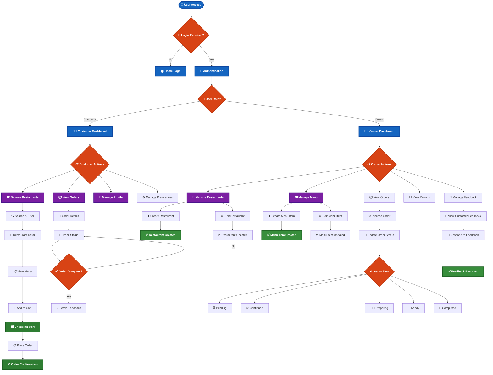
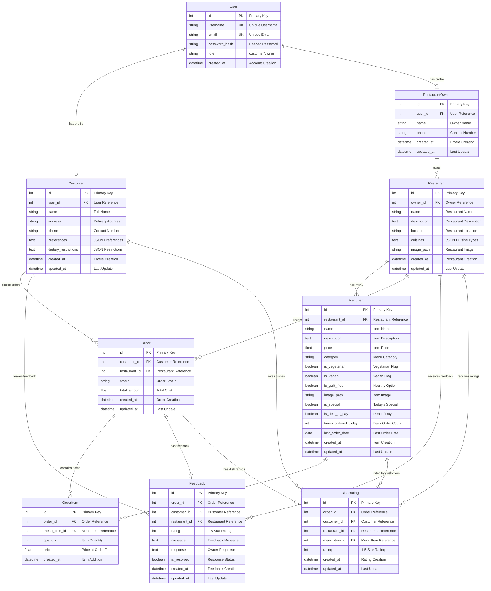
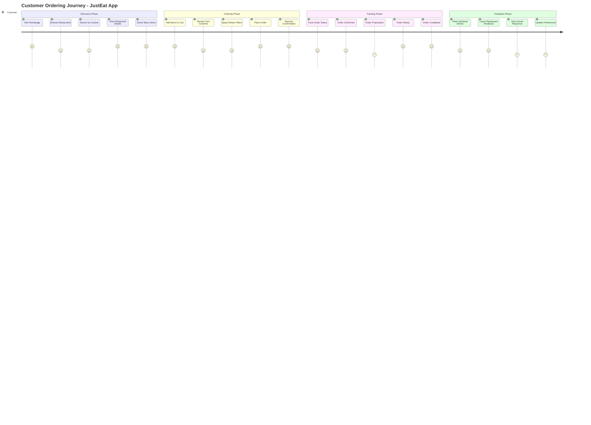
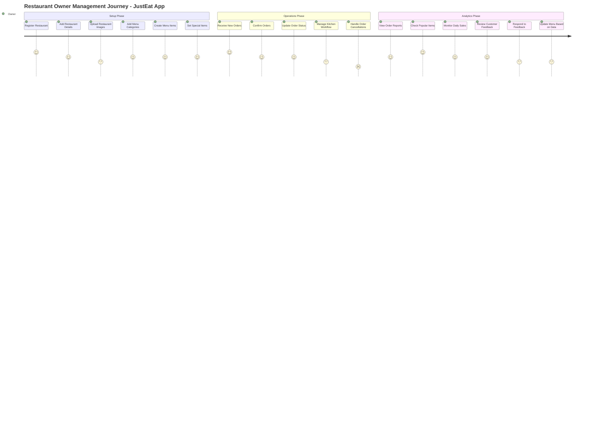
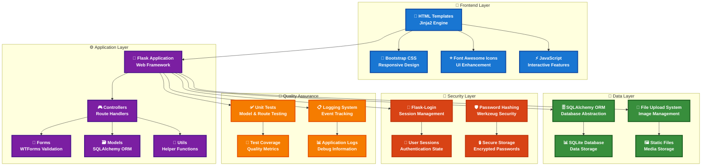
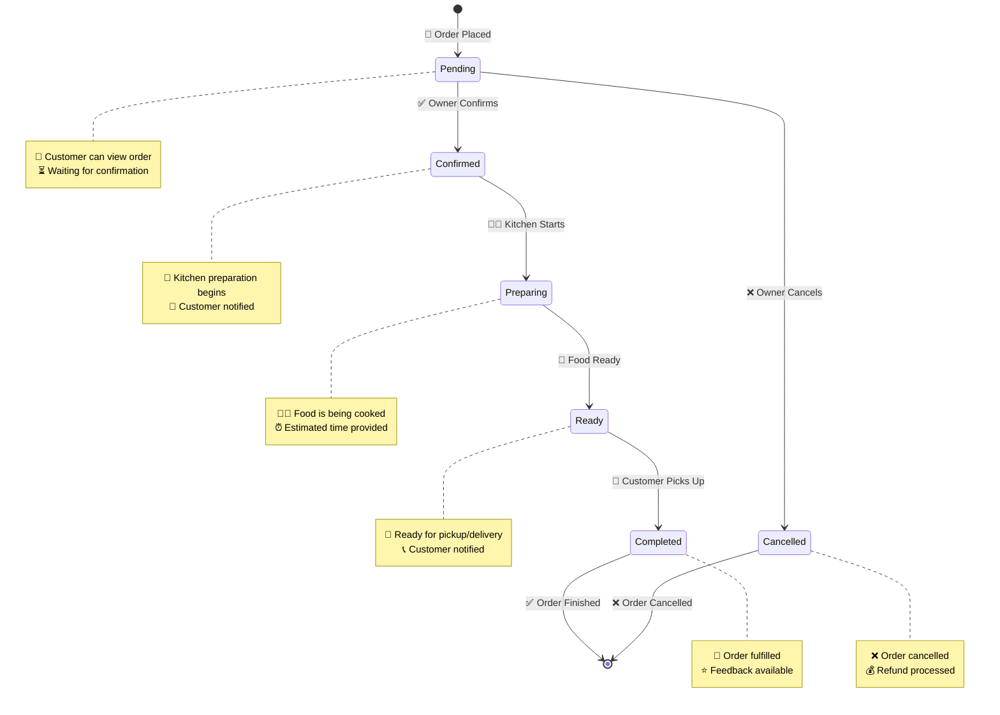
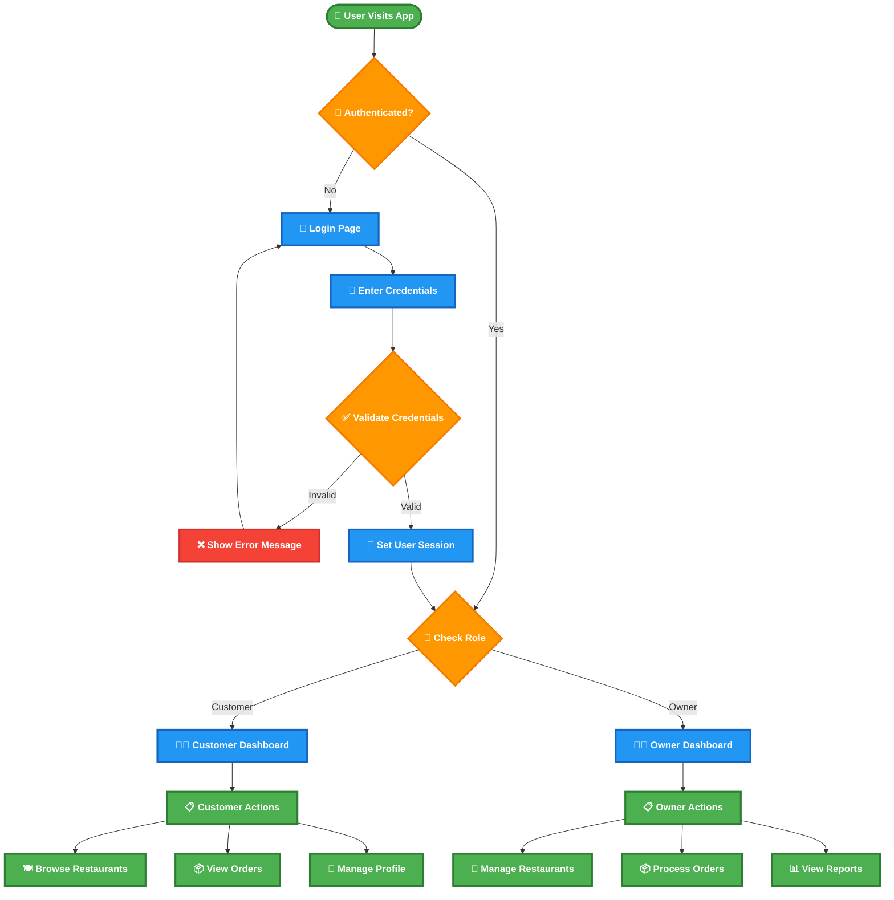
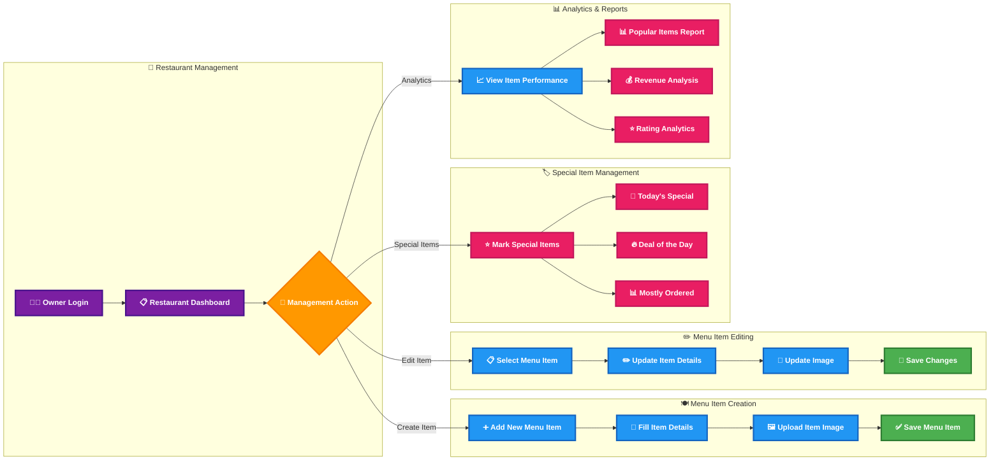

# JustEat Food Ordering Application - Enhanced Professional Diagrams

## 1. System Architecture & User Flow Overview (Enhanced)

## 2. Database Entity Relationship Diagram (Enhanced)

## 3. Customer Journey Flow (Enhanced)

## 4. Owner Management Flow (Enhanced)

## 5. System Components Architecture (Enhanced)

## 6. Order Status Workflow (Enhanced)

## 7. User Authentication Flow (New)

## 8. Menu Management Workflow (New)

These enhanced diagrams feature:

✅ **High Contrast Colors**: Dark backgrounds with white text for excellent readability
✅ **Professional Icons**: Emojis and symbols for visual clarity
✅ **Bold Typography**: Enhanced font weights for better visibility
✅ **Clear Labels**: Descriptive text with context
✅ **Logical Grouping**: Related elements grouped together
✅ **Enhanced Relationships**: Clear connection labels
✅ **Status Indicators**: Visual feedback for different states
✅ **Comprehensive Coverage**: All major workflows included

You can copy any of these enhanced diagrams directly into Mermaid Live Editor or any Mermaid-compatible tool for professional, easy-to-read visualizations! 🚀
