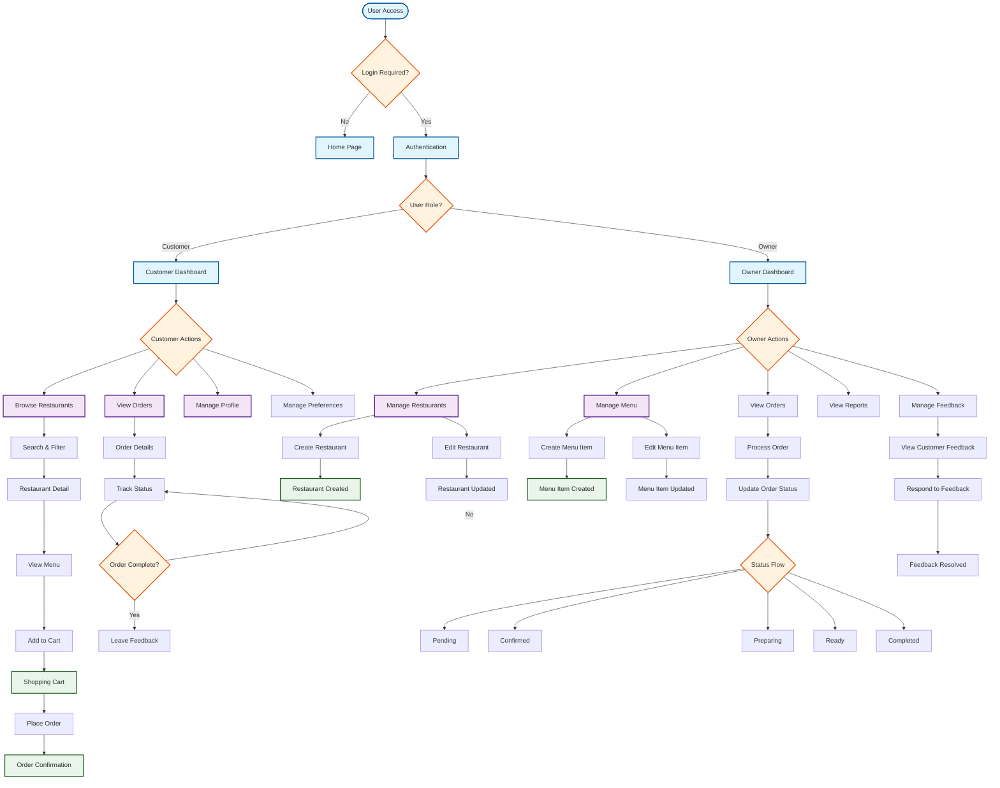
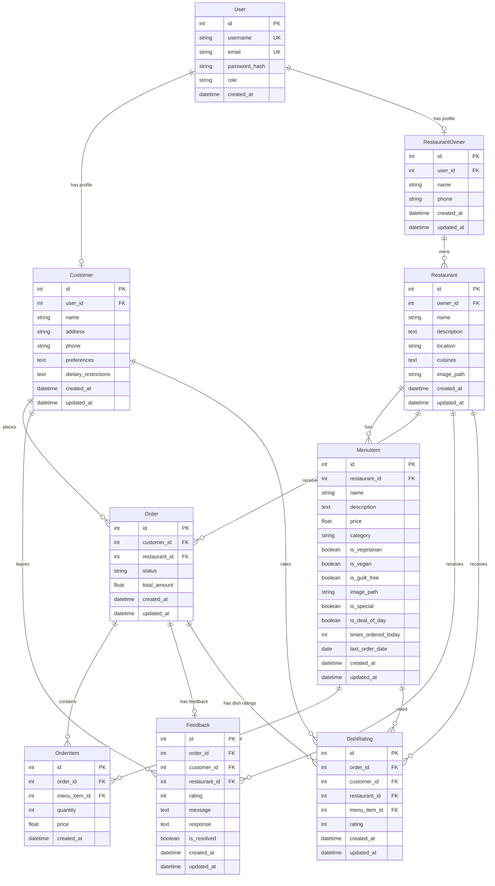
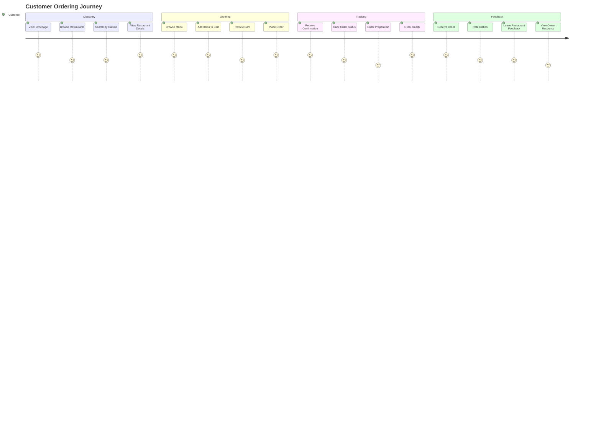
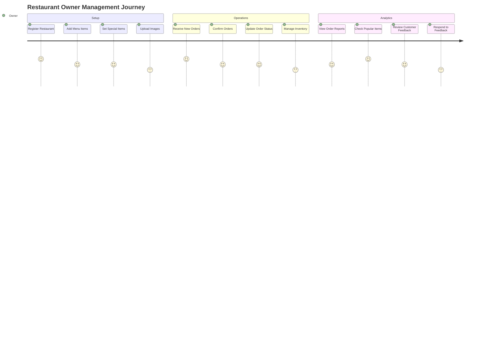
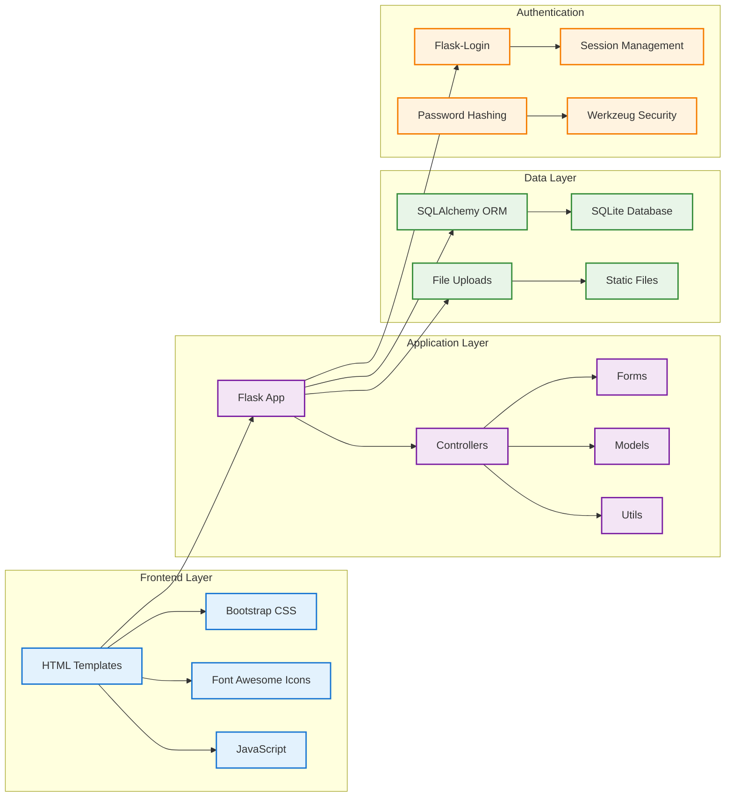
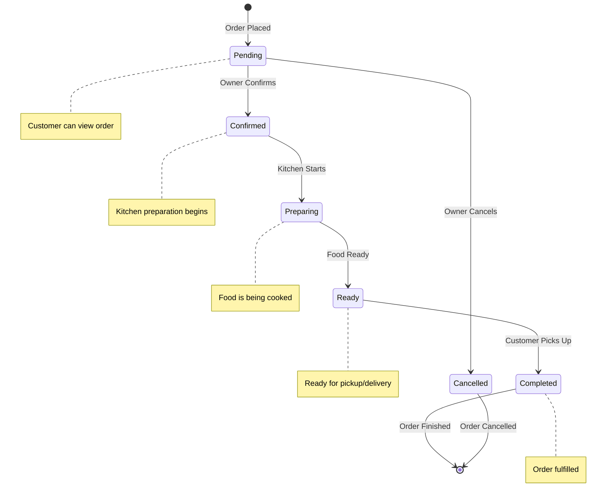

# JustEat Food Ordering Application - Complete Workflow Diagram

## System Architecture & User Flow Overview

## Database Entity Relationship Diagram

## Customer Journey Flow

## Owner Management Flow

## System Components Architecture

## Order Status Workflow

## Key Features & Capabilities

### Customer Features
- **Restaurant Discovery**: Search by name, location, cuisine type
- **Smart Filtering**: Dietary preferences, price range, special items
- **Shopping Cart**: Session-based cart with quantity management
- **Order Tracking**: Real-time status updates
- **Feedback System**: Rate dishes and restaurants
- **Preferences**: Save favorite cuisines and restaurants
- **Recommendations**: Personalized suggestions based on history

### Owner Features
- **Restaurant Management**: Create, edit, delete restaurants
- **Menu Management**: Add, edit, delete menu items with images
- **Order Processing**: Update order status through workflow
- **Analytics**: View reports on popular items and revenue
- **Feedback Management**: Respond to customer feedback
- **Special Items**: Mark items as "Today's Special" or "Deal of the Day"

### System Features
- **Role-based Authentication**: Separate customer and owner access
- **Secure Password Management**: Hashing, reset, and change functionality
- **File Upload**: Secure image handling for restaurants and menu items
- **Database Migrations**: Version-controlled schema changes
- **Comprehensive Testing**: Unit tests for models and routes
- **Logging**: Application and security event logging
- **Responsive Design**: Mobile-friendly Bootstrap interface

## Technology Stack

- **Backend**: Flask 2.x, SQLAlchemy ORM, Flask-Login, Flask-WTF
- **Frontend**: Bootstrap 5.3.0, Font Awesome 6.4.0, Vanilla JavaScript
- **Database**: SQLite with Alembic migrations
- **Security**: Werkzeug password hashing, CSRF protection
- **Testing**: Python unittest framework
- **Development**: Virtual environment, Git version control

This comprehensive workflow diagram illustrates the complete JustEat food ordering application, showing user journeys, system architecture, database relationships, and key features. The application demonstrates a well-structured, scalable food ordering platform with role-based access, comprehensive order management, and modern web development practices.
